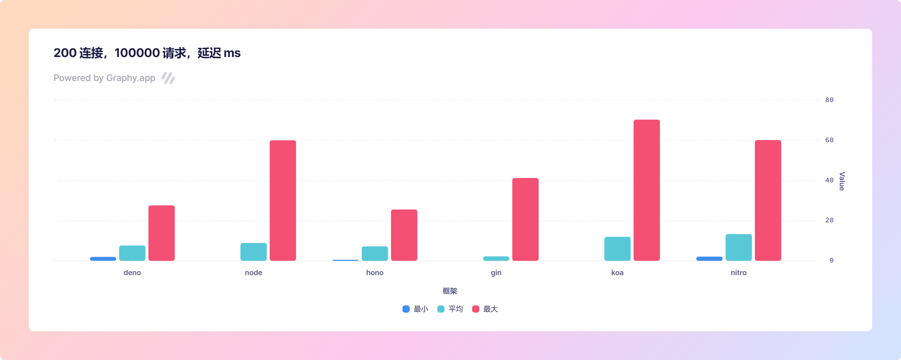

# 标准

```shell
plow http://127.0.0.1:3000/ -c 200 -n 100000
```


- 同时刻下 200 个连接 
- 共计 100000 个请求


# 结果




| framework | Min   | Mean   | Max    |
| --------- | ----- | ------ | ------ |
| deno      | 1.968 | 7.63   | 27.614 |
| node      | 0     | 8.912  | 60.042 |
| hono      | 0.515 | 7.208  | 25.578 |
| gin       | 0     | 2.22   | 41.269 |
| koa       | 0     | 11.941 | 70.326 |
| nitro     | 2.101 | 13.321 | 60.149 |
		
	


